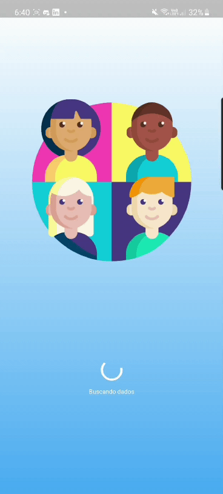
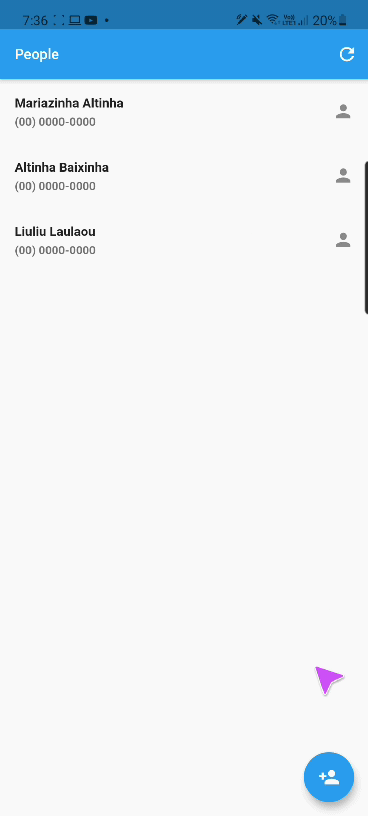
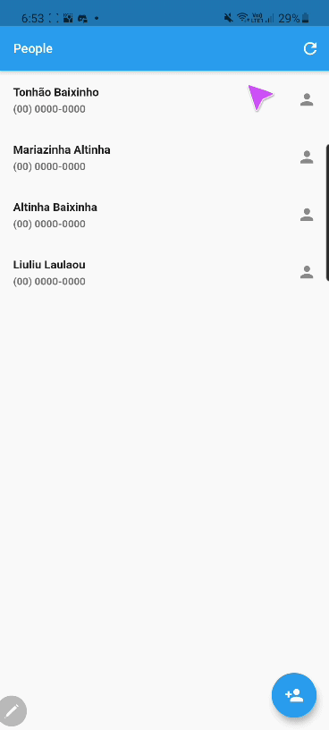

# person-api-client

Esse projeto surge como desafio complementar para a API que gerencia pessoas de uma organização proposto pela plataforma de ensino DIO e pode ser encontrado nesse [repositório](https://github.com/UellingtonDamasceno/person-api).

## Features

- [x] Splash Screen.
- [x] Listar todas as pessoas.
  - [ ] Permitir a exibição asc/dec.
  - [ ] Filtrar por nome.
- [x] Deletar uma pessoa.
- [x] Adicionar uma nova pessoa.
- [ ] Atualizar uma pessoa.

## Screnshots

|  |  |  |
| -------------------------------------------------------- | ----------------------------------------------------- | -------------------------------------------------------- |

## Créditos

Icons made by <a href="https://www.freepik.com" title="Freepik">Freepik</a> from <a href="https://www.flaticon.com/" title="Flaticon">www.flaticon.com</a>

---

| :arrow_left: [Mais flutter](https://github.com/UellingtonDamasceno/clash-of-clans-cards) | ............................... :arrow_up: [Voltar ao topo](#person-api-client) :arrow_up: ............................... | [Person API](https://github.com/UellingtonDamasceno/person-api) :arrow_right: |
| :--------------------------------------------------------------------------------------: | -------------------------------------------------------------------------------------------------------------------------- | :---------------------------------------------------------------------------: |
